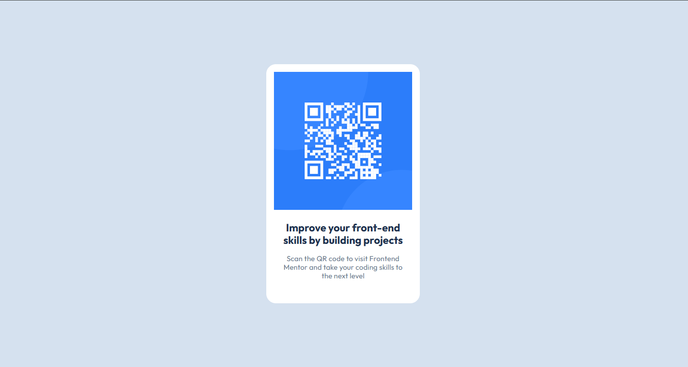
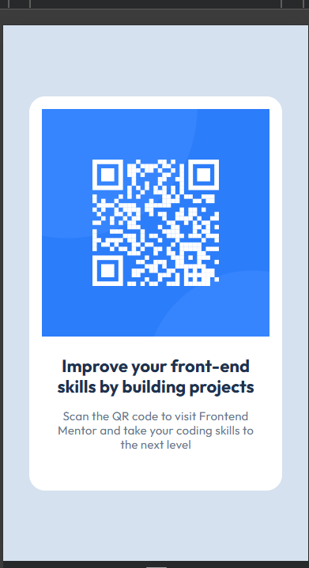

# QR code component solution

## Table of contents

- [Overview](#overview)
  - [Screenshot](#screenshot)
  - [Links](#links)
- [My process](#my-process)
  - [Built with](#built-with)
  - [What I learned](#what-i-learned)
  - [Continued development](#continued-development)
  - [Useful resources](#useful-resources)
- [Author](#author)
- [Acknowledgments](#acknowledgments)

## Overview

### Screenshots

### Links

- Solution URL: [Solution](https://github.com/rinta-git/QR-CODE-STATIC-APP/blob/main/index.html)
- Live Site URL: [QR-CODE-APP](https://rinta-git.github.io/QR-CODE-STATIC-APP/)

## My process

### Built with

- Semantic HTML5 markup
- CSS custom properties
- Flexbox
- Mobile-first workflow
- Figma designs

### What I learned

Revised the use of flexbox and usage of css variables.

### Useful resources

- [Resource 1 for CSS](https://web.dev/learn/css/) - This website helped me for quick recap over css properties. I really liked this detailed explanation and will use it going forward.
- [Video resource](https://www.youtube.com/watch?v=xCSw6bPXZks&ab_channel=CoderCoder) - This is an amazing youtube video which helped me finally understand why not to use px instead of rem for font-size. I'd recommend it to anyone still learning this concept.

## Author

- Website - [Rinta Roy](https://www.linkedin.com/in/rinta-roy)
- Frontend Mentor - [@rinta-git](https://www.frontendmentor.io/profile/rinta-git)
